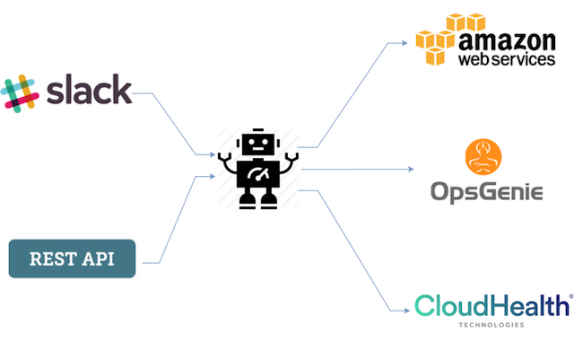

# Huggies

## Overview

Huggies is a side project that I started when working for the NAPI team which pronounced as ['næpɪ], and that is why I named it as Huggies ;) 

The team's environments are mostly on AWS Elastic Beanstalk. In general, Elastic Beanstalk is a good tool as it abstracts the complexicity of managing Elastic Load Balancer, Autoscaling group, Route 53 etc. It allows developers to focus on the codes, instead of worrying much about the running environments. But there were still a few pain points that I observed the team was sufferring:

- Hard to start or stop environments
- Hard to manage the environments scheduled scaling
- Elastic Beanstalk does not support spot instance

Huggies is built on Hubot framework, it is a plug and play tool which solves the above the pain points.     

Watch the two video demo if you are interested:   
<video>(https://youtu.be/_urUn_5jX6c)</video>   
<video>(https://youtu.be/GROXO9n32kk)</video>    

## Design


## Features
- Support both Slack and RESTful API
- Role based user management
- Start/stop single Elastic Beanstalk environment
- Start/stop multiple Elastic Beanstalk environments
- Show Elastic Beanstalk environment details
- Use spot instances for Elastic Beanstalk environments
- Report activities in Slack channel
- Monitor spot instance request status, and automatically adjust bid price
- Custom scale up/down schedule
- Support multiple AWS accounts and regions
- Check the monthly/weekly/daily/hourly AWS cost (via CloudHealth)
- Find out the oncall stuff (via OpsGenie)

## Install
```js
git clone https://github.com/jc1518/Huggies.git
cd Huggies
npm install
```
Setup your environment variables in [envvars](lib/envvars)   

```js
source lib/envvars; bin/hubot --adapter slack
```

## Usage

Main help

```js
Usage:
    `aws cost ?` - See CloudHealth subcommands
    `aws eb ?  ` - See AWS Elastic Beanstalk subcommands
    `ops ?     ` - See Opsgenie subcommands
```

AWS cost help (require CloudHealth)

```js
Usage:
    `aws cost saving` - show month to date saving
    `aws cost <monthly|weekly|daily|hourly>` - show AWS monthly/weekly/daily/hourly cost 
```

AWS Elastic Beanstalk help

```js
Usage:
    `aws eb start <environment[@min:max]>` - start Elastic Beanstalk environment
    `aws eb stop <environment>` - stop Elastic Beanstalk environment
    `aws eb show <environment>` - show Elastic Beanstalk environment info
    `aws eb spot-on <environment> <instance_type> <bid_price>` - enable spot instance for Elastic Beanstalk environment
    `aws eb spot-off <environment>` - disable spot instance for Elastic Beanstalk environment
    `aws eb spot-show all` - show spot request status and spot instance enabled environments
    `aws eb autostart-<on|off|show> <environment>[@hh:mm]` - turn on/off or show autostart for Elastic Beanstalk environment
    `aws eb autostop-<on|off|show> <environment>[@hh:mm]` - turn on/off or show autostop for Elastic Beanstalk environment
```

Ops help (require OpsGenie)

```js
Usage:
    `ops who is oncall` - See who is the poor guy this week
```

## FAQ

- How to grant Slack user access?    
Add slack user's email in [slackusers.js](lib/slackusers.js) file, role are the environment names seperated with comma or Admin which has access to all environments.     


- How to manage RESTful API users?     
Add user in [apiusers.js](lib/apiusers.js), role are the environment names seperated with comma or Admin which has access to all environments. The inline passwords are encrypted. Use [encrypt.js](lib/encrypt.js) to encrypt the password string when create new users.      

- How to consolidate multiple environments into one?      
Add the consolidated environments in [ebenvs.js](lib/ebenvs.js). e.g Consolidate myapp-dev, myapp-uat into myapp-nonprod. So 'aws eb start myapp-nonprod' can start both myapp-dev and myapp-uat in one shot.
  

- How to start/stop environment via RESTful API?          
Examples:    
`curl -X POST -H "Content-Type: application/json" -d '{"username":"your_username","password":"your_password","server":"your_environment"}' http://huggies_server_ip:8080/aws/eb/start`      
`curl -X POST -H "Content-Type: application/json" -d '{"username":"your_username","password":"your_password","server":"your_environmet"}' http://huggies_server_ip:8080/aws/eb/stop`      


- How to enable/disable spot instance for environment via RESTful API?          
Examples:    
`curl -X POST -H "Content-Type: application/json" -d '{"username":"your_username","password":"your_password","server":"your_environment","instance":"instance_type","price":"bid_price"}' http://huggies_server_ip:8080/aws/eb/spoton`      
`curl -X POST -H "Content-Type: application/json" -d '{"username":"your_username","password":"your_password","server":"your_environmet"}' http://huggies_server_ip:8080/aws/eb/spotoff`      


- How to monitor spot instance request?     
Setup a cron job, e.g `* * * * * /usr/local/src/node-v4.4.7-linux-x64/bin/node /home/ec2-user/huggies/lib/bid_monitor.js`    


- How Huggies makes Elastic Beanstalk support spot instance?    
Check the [details](https://jackiechen.org/2017/05/24/run-autoscaling-group-on-spot-instance-in-a-smart-way/)   


